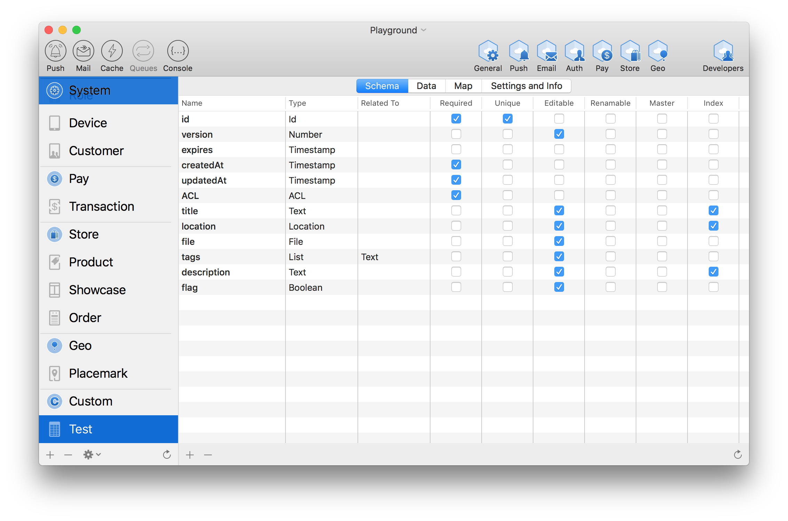

# Collections and Schema
*Collections** are groups of morphological equal objects, or documents, whom structure is defined by a collection Schema. In conventional database terminology see a Collection as a data table.
Each Collection has its own schema, or structure, defined by attributes. Each Attribute has its own data type (see [Data Types](data-types.md)). 
As a convention you give to a Collection the singular name of the document Type that it is going to represent, such as Invoice, Customer, Product. 

A Collection is represented by instance of type Collection. Each Collection has a single reference to the remote project (client) used to access the data. 



You can create and define structure of your collections with **naee Studio**, but it is also possible to define or alter a Collection schema directly by code:

```
let collection = Collection(name: "Product")
collection.addAttribute(Attribute(name: "sku", type: .Text))
collection.addAttribute(Attribute(name: "name", type: .Text))
collection.save { error in
	if error == nil {
		// The collection now has a new schema 
	}
}
```
*NOTE: Saving a Collection simply update the schema and do not save or alter the contained documents.* 
# Attributes
An attribute is a definition of a single element of data making part of a collection's scheme. Attributes are analogue to columns in conventional database structures.
The type of data contained in each Collection's attribute is defined in [Data Types](data-types.md).
Attributes also have some properties, aimed to define some behaviors of the corresponding data they represent.
## Attribute properties
| Name | Behavior |
|:-|:-|
| unique | The attribute value has to be unique in the whole collection. Saving a document with a duplicated value for this attribute, will rise an error. 

