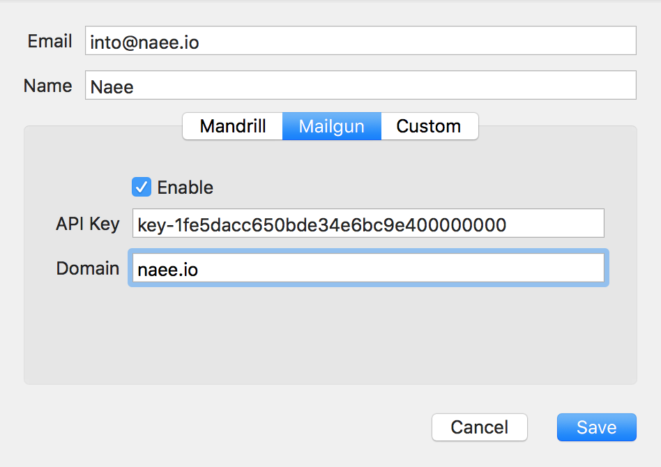

# Mail
**naee** provides a trivial way to send mail from you app:

1. Create a MailMessage with subject, body and even attachments
2. Use MailManager to send the message, specifying recipients and other send options

```swift
let message = MailMessage(subject: “Hello world”,
                          body: “A message from my app”)
MailManager.send(message) {error in

}
```
## Mail configuration
In order to send mail message from your app, in **naee Studio** you have to configure the project for the chosen mail provider:


### SMTP
Provide the server address, authentication parameters and optional port and SSL mode.
### Mailgun
Provide your API key, Secret and domain, obtained from your Mailgun account.
### Mailchimp
Provide your API key, Secret and domain, obtained from your Mailchimp account
## Attachments
### Local files or data as attachments
### File documents as attachments
## Mail templates
### Local templates
### Configured templates