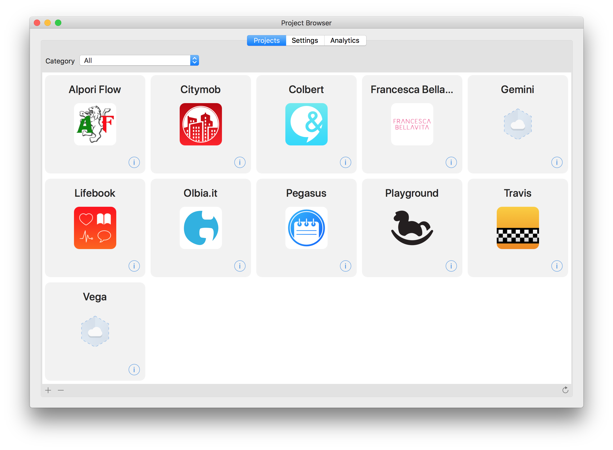
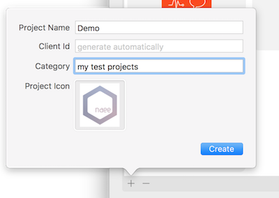

# Getting started

## Download **naee Studio**
**naee Studio** is the control center app from where you can organize and configure your **naee** projects. It is a native macOS app, available [here](dev.naee.io/downloads/naee-studio).

1. Download **naee Studio**
2. At first lunch enter your **naee** account credentials (email and password)

## Create a project in **naee Studio**
The first windows that you will see is the Projects Browser. 



Of course there will be no projects, so you have to create one:

1. Press the + button in the bottom bar of the Projects Browser



2. Insert a name for your Project. This is the official name that typically correspond to your app name. 
3. Optionally add a Project icon. It is used on web pages visible by your customers and to your teammates in **naee Studio**
4. Press Create

Done! Now you have your first **naee** Project, ready to use.

## Add your first Data Collection
To be useful, a backend Project needs at least some data in it, so we have to create the data container.

1. In the Project Browser, double click on the newly created project. The project window will appear.
2. Some collections are already present: User, Role and Device. They are system collections used by the platform. You’ll se later when and how to use them.
3. Clic on the plus button on the lower left corner of the window do create your first Collection
4. Name it Test. *As a convention, Collection names start with a capital letter*.
5. Press **Create**.

Now that you have your Test Collection, What do you need is to configure the type of data that it will contain. This is called **schema**. On the right pane of the newly created Collection, you se some attributes already present in the schema; these are the default attributes for every Collection, such creation date, update date, document id, etc. (more later).

1. Press the + button in the bottom bar below the default attributes
2. Create an attribute named “title” of type Text. *By convention attribute name start with a lowercase letter*.
3. Press create

Great! Now we have a new Collection Test that can contain documents that, among other informations, have a title each.

## Download the SDK
The next step is to download the SDK for the platform you intend to develop for.

1. Go to the [Download page](dev.naee.io/downloads)
2. Select the platform
3. Download the corresponding SDK
4. Unzip it and leave it...we’ll return in a moment

## Create or open your app project
1. Open your platform’s IDE, such as Xcode or Android Studio
2. Create a new, simple project, like single view app for iOS or single activity app for Android

## Import the SDK library in your project
To import the SDK library you just downloaded, follow the rules of the corresponding platform. See [SDK Installation](install.md).

## Configure the Client instance
The first thing you have to do is configure your client to communicate with the **naee** Project you just created. To do that you have to provide two keys:

- clientId
- clientKey

They are automatically generated during the project creation. To obtain them:

1. In **naee Studio** open the Project Browser (key cmd-0)
2. Click the info button (i) on the bottom right corner of your project’s icon
3. A popover will display the project’s keys.



Typically you configure the client in the entry point of your application, such as the AppDelegate on Apple platform, or in the Main Activity on Android. You can even configure the client inserting the key into the app info.plist (Apple) or manifest (Android), but for the momento we’ll use the code way.



```swift
Client.default.configure(clientId: “*your client id*, clientKey: “*your client key*)
```



```kotlin
Client.default.configure(“*your client id*”, “*your client key*”)
```



```java
Client.default.configure”*your client id*”, “*your client key*”);
```



*Note:* normally the syntactical differences on the various languages are very subtle that now on we’ll show only the Swift version, with some particular exceptions.

## Create your first document

The Client is configured and we can create our first document in the Collection “Test”.

*In Swift* (Apple platforms)

```swift
let collection = Collection(name: “Test”)
let document = Document(collection: collection)
document.set(string: “My first document”, for: “title”)
document.save { error in
	if error == nil {
		// Your document is on the cloud!
	}
}
```

*In Kotlin* (Android)

```kotlin
val collection = Collection(“Test”)
val document = Document(collection)
document.setString(“My first document”, “title”)
document.save { error ->
	if (error == null) {
		// Your document is on the cloud!
	}
}
```

*In Java* (Android)

```java
Collection collection = new Collection(“Test”);
Document document = new Document(collection);
document.setString(“My first document”, “title”);
document.save(new DocumentCallback(NError error) {
	if (error == null) {
		// Your document is on the cloud!
	}
});
```

Few lines of code and your data is on the cloud! That’s amazing, isn’t it? 

## Search documents



Saving documents on the cloud is a good thing, but retrieving them is even better.

Let’s search for documents having title containing the word “document”, as the one we just created.


```swift
let collection = Collection(name: “Test”)
let query = Query(collection: collection)
	.where(“title”, contains: “document”)
query.fetchDocuments { documents, error in
	if error == nil {
		print(documents.first!.string(for: “title”)
		// “My first document”
	}
}
```


```kotlin
val collection = Collection(“Test”)
val query = Query(collection)
	.contains(“document”, “title”)
query.fetchDocuments { documents, error ->
	if (error == null) {
		print(documents[0].getString(“title”)
		// “My first document”
	}
}
```


```java
Collection collection = new Collection(“Test”);
Query query = new Query(collection)
	.contains(“document”, “title”);
query.fetchDocuments(new DocumentsCallback(documents, error) { 
	if (error == null) {
		print(documents[0].getString(“title”)
		// “My first document”
	}
});
```



Easy ah? More on queries and documents in later section of this site.

## What now?

This was just a starting point to let you getting in touch with the **naee** platform. As you can see is very easy to deal with, but you’ll learn how much is powerful and flexible.

Happy coding with **naee**!